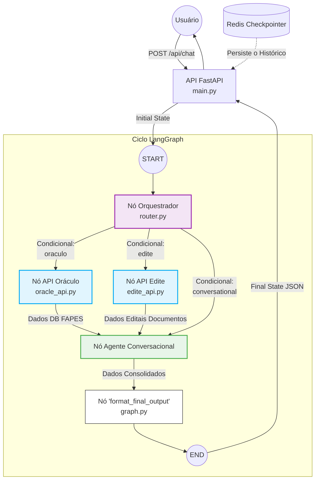

# Multi-Orquestrador Oráculo

Processo para utilização do Multi-Orquestrador integrado ao backend do Oráculo.

## Pré-requisitos
- **Docker** e **Docker Compose** instalados e rodando.
- O **backend do Oráculo** deve estar rodando a rede externa `oraculo-network` ao ser iniciado, pois os serviços do orquestrador dependem dela para comunicação.

## Passo a Passo para Iniciar

### 1. Configurar Variáveis de Ambiente
Verifique se o arquivo `.env` na raiz do repositório (`oraculo-multi-agent`) está configurado com as chaves de API e URLs necessárias. Estes valores são repassados para os containers no momento em que sobem.

```
LLM_API_KEY= #chave de api da openai
DATABASE_URL= # banco vetorial com os embeddings dos editais
REDIS_URL=redis://redis:6379
ORACLE_API_TOKEN= # token de confirmação para api da edite
EDITE_URL= http://edite_agent:8003 
ORACULO_URL=http://host.docker.internal:8001
```

### 2. Iniciar o Backend do Oráculo
Certifique-se de que o backend principal do Oráculo está rodando. Ele é responsável por subir a rede `oraculo-network`, além das APIs (como a disponível na porta `8001`) que os agentes vão consultar.

### 3. Subir a Infraestrutura Base (Redis)
O orquestrador requer o Redis para gerenciamento do estado dos agentes e filas de mensagens. Inicie-o primeiro a partir da pasta `infra`:

```bash
cd infra
docker-compose up -d
cd ..
```

### 4. Iniciar os Agentes do Multi-Orquestrador
Na raiz do repositório (onde o arquivo `docker-compose.yml` principal se encontra), rode o comando abaixo para realizar o build e subir os serviços `agent` e `edite_agent`:

```bash
docker-compose up --build -d
```

### 5. Consumo da API (Orquestrador)
Com o sistema rodando, o orquestrador multiagente pode ser consumido via HTTP POST no endpoint `/api/chat`.

Exemplo de requisição no terminal:

```bash
curl -X POST http://localhost:8004/api/chat \
  -H "Content-Type: application/json" \
  -d '{"user_input": "top 5 projetos por valor pago"}'
```

---

## Arquitetura do Orquestrador Multiagente

O sistema orquestrador multiagente funciona como o roteador inteligente das requisições, mapeando componentes através do **LangGraph** e sendo exposto por uma API **FastAPI**.

### Componentes Principais

#### 1. Orquestrador (`router.py`)
- **Papel:** Analisa a entrada do usuário e o histórico da conversa utilizando um LLM (`gpt-4.1-mini`) com saída estruturada.
- **Responsabilidade:** Identificar as intenções da solicitação e decidir quais agentes especialistas devem ser chamados (podendo ser múltiplos, visando execução paralela), gerando instruções autocontidas para cada um.

#### 2. Gerenciamento de Estado (`state.py` e `models.py`)
- O `MultiAgentState` mantém estado compartilhado no grafo (histórico, chamadas de agentes e resultados obtidos).
- Os modelos `RouterDecision` e `AgentCall` garantem as restrições da delegação de tarefas de forma estrurada via Pydantic.

#### 3. Agentes Especialistas e Nós de Grafo
- **API Oráculo (`apis/oracle_api.py`):** Consulta a base de dados relacional (SQL) do Oráculo para buscar métricas e dados financeiros.
- **API Edite (`apis/edite_api.py`):** Consulta a base de documentos e PDFs (RAG) em busca de regras de editais e manuais.
- **Agente Conversacional (`agents/conversational_agent.py`):** Consolida as respostas vindas estruturadas ou em JSON das duas APIs acima usando um LLM configurado (`gpt-4.1-nano`), processando tudo numa resposta única e coesa para o usuário.

### Fluxo e Diagrama de Execução

1. O usuário chama o endpoint da FastAPI (`POST /api/chat`).
2. O **Orquestrador** analisa a intenção e faz roteamento condicional para a API Oráculo, Edite, ou as duas ao mesmo tempo.
3. Terminado o processamento, ambos os resultados convergem para o nó do **Agente Conversacional**, que cria a resposta final.



